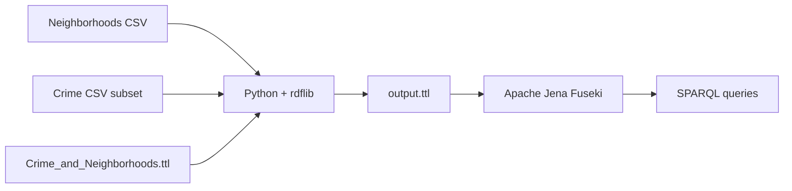

# A BFO-Conformant Knowledge Graph of Minneapolis Crime Data

A small end-to-end project that takes two unrelated CSV files from the City of Minneapolis open data portal, maps them to RDF using a BFO-conformant OWL ontology, and exposes the result as a SPARQL-queryable knowledge graph in Apache Jena Fuseki.

## Motivation

The two source datasets, Minneapolis neighborhoods and Minneapolis crime incidents, are published independently and share no stored foreign key. They can only be joined by matching neighborhood name strings, which is brittle and tells you nothing about what kind of thing a neighborhood is or what kind of thing a crime is. An ontology lets you say more: that a neighborhood is a fiat geographic region (a `bfo:Site`), that a crime incident is a process unfolding in time (a `bfo:Process`), and that the relationship between them is one of occurrence rather than mere co-location.

That reframing has practical value. It makes the data interoperable with any other BFO-grounded ontology, gives downstream consumers a semantic contract rather than a fragile column-name convention, and lets you reuse the same ontology across other jurisdictions or other event-in-region domains without rewriting the schema.

## Data sources

Both files were downloaded from the [Minneapolis Open Data portal](https://opendata.minneapolismn.gov/):

- **Minneapolis Neighborhoods** (87 rows): official neighborhood boundaries, identified by `BDNAME` and `BDNUM`.
- **Crime Data** (subset of 102 rows): incidents from three neighborhoods, Corcoran, Stevens Square, and Powderhorn, taken from a much larger dataset to keep the working scope manageable.

The neighborhood column in the crime data and the `BDNAME` column in the neighborhoods data use identical name strings, which makes them joinable in the mapping step.

## Ontology design

The ontology imports BFO 2020 and adds a small number of domain classes underneath the relevant BFO parents.

### Class hierarchy

```
bfo:IndependentContinuant
  └── bfo:ImmaterialEntity
        └── bfo:Site
              └── mpls:Neighborhood
                    └── mpls:MinneapolisNeighborhood

bfo:Occurrent
  └── bfo:Process
        └── mpls:CrimeIncident
```

`Neighborhood` is the universal class. `MinneapolisNeighborhood` is the subclass whose instances are specifically neighborhoods of Minneapolis. Data individuals are typed to the more specific class.

### Object property

A single object property, `bfo:occurs_in` (`BFO_0000066`), links each `CrimeIncident` to the `MinneapolisNeighborhood` in which it took place.

### Data properties

| Property | Domain | Range |
|---|---|---|
| `caseNumber` | `CrimeIncident` | `xsd:string` |
| `reportedDate` | `CrimeIncident` | `xsd:dateTime` |
| `occurredDate` | `CrimeIncident` | `xsd:dateTime` |
| `offense` | `CrimeIncident` | `xsd:string` |
| `address` | `CrimeIncident` | `xsd:string` |
| `precinct` | `CrimeIncident` | `xsd:integer` |
| `ward` | `CrimeIncident` | `xsd:integer` |
| `neighborhoodName` | `Neighborhood` | `xsd:string` |
| `neighborhoodNumber` | `Neighborhood` | `xsd:integer` |
| `areaSize` | `Neighborhood` | `xsd:decimal` |

### Design decisions worth noting

**Offense as a data property, not a class.** The original schema in early drafts had `Offense` and `OffenseCategory` as subclasses of `CrimeIncident`. `OffenseCategory` was dropped because a classification scheme is an information content entity, a `bfo:GenericallyDependentContinuant`, not a process. `Offense` was dropped as a class because the source data carries offense as a string value rather than a structured taxonomy. Modeling it as a class hierarchy would have meant manually constructing a taxonomy that wasn't actually present in the data.

**Neighborhood vs. MinneapolisNeighborhood.** The general class exists so that the ontology is not parochial. A Minneapolis neighborhood is a kind of neighborhood, not a kind unto itself. Other municipalities could add their own subclasses without redefining what a neighborhood is.

**BFO 2020 imported directly.** The ontology declares `owl:imports` against the BFO 2020 IRI, which means it cannot be loaded offline without a local copy but produces a single coherent graph when loaded with a reasoner.

## Pipeline



The mapping script reads both CSVs with pandas, mints URIs for each individual, attaches data properties using the ontology's vocabulary, and creates `occurs_in` links by matching neighborhood names between the two tables. The resulting Turtle file contains 1,516 triples (46 ontology triples, 348 neighborhood triples, and the remainder from the 102 incidents and their links).

## Example queries

All queries use these prefixes:

```sparql
PREFIX mpls: <https://ian-reinl.github.io/mpls-crime-ontology/Crime_and_Neighborhoods.ttl#>
PREFIX bfo:  <http://purl.obolibrary.org/obo/>
```

### Q1: List all Minneapolis neighborhoods

```sparql
SELECT ?name ?number
WHERE {
  ?n a mpls:MinneapolisNeighborhood ;
     mpls:neighborhoodName   ?name ;
     mpls:neighborhoodNumber ?number .
}
ORDER BY ?number
```

Returns all 87 neighborhoods with their administrative numbers.

### Q2: Incidents in a specific neighborhood

```sparql
SELECT ?caseNumber ?offense ?occurredDate
WHERE {
  ?n a mpls:MinneapolisNeighborhood ;
     mpls:neighborhoodName "Corcoran" ;
     ^bfo:BFO_0000066 ?incident .
  ?incident mpls:caseNumber   ?caseNumber ;
            mpls:offense      ?offense ;
            mpls:occurredDate ?occurredDate .
}
ORDER BY ?occurredDate
```

Returns the case number, offense type, and date of every crime incident linked to the Corcoran neighborhood. The `^bfo:BFO_0000066` syntax is SPARQL property-path inversion, which lets you traverse the `occurs_in` relation in reverse without defining a separate object property.

### Q3: Incident count per neighborhood

```sparql
SELECT ?name (COUNT(?incident) AS ?incidentCount)
WHERE {
  ?n a mpls:MinneapolisNeighborhood ;
     mpls:neighborhoodName ?name ;
     ^bfo:BFO_0000066 ?incident .
}
GROUP BY ?name
ORDER BY DESC(?incidentCount)
```

Returns one row per neighborhood that has at least one linked incident, with the count. In the current subset that's three rows: Corcoran, Stevens Square, and Powderhorn.

## Repository contents

| File | Purpose |
|---|---|
| `ontology.ttl` | The BFO-conformant OWL ontology in Turtle. |
| `map_to_rdf.ipynb` | Jupyter notebook that reads the CSVs and writes `output.ttl`. |
| `data/Minneapolis_Neighborhoods.csv` | Source data, unmodified from the open data portal. |
| `data/Crime_Data_Subset.xlsx` | Source data, filtered to three neighborhoods. |
| `output.ttl` | The generated RDF knowledge graph (1,516 triples). |
| `queries.sparql` | The example queries above and a few additional ones. |
| `README.md` | This file. |

## Technologies

- **BFO 2020** (Basic Formal Ontology), imported directly from the OBO Foundry.
- **OWL 2** for the ontology, authored in **Protégé**.
- **Python** with **pandas** and **rdflib** for the ETL pipeline.
- **Apache Jena Fuseki** as the SPARQL endpoint and triplestore.
- **Minneapolis Open Data** for both CSV sources.

## Limitations and future work

The project is deliberately small. Several things it does not yet do:

- **No reasoning is applied.** A reasoner like HermiT or Pellet could infer additional triples from the BFO axioms, the inverse of `occurs_in`, and the domain and range declarations on the data properties. Adding this would make the graph richer at query time without changing the source data.
- **The crime subset is three neighborhoods.** Scaling to the full dataset is mechanically straightforward but produces a much larger graph that would benefit from named graphs per data source.
- **`Offense` is a string.** A future iteration could align offense values to the NIBRS coding standard as a class hierarchy under `CrimeIncident`, which would let SPARQL queries filter by category as well as specific offense.
- **No CCO integration.** The Common Core Ontologies sit between BFO and domain ontologies and would be the natural next layer, particularly `cco:IntentionalAct` for crime incidents and the CCO Geospatial Ontology for neighborhoods. Adding CCO would strengthen the ontology's interoperability with defense and intelligence sector applications.
- **The `occurs_in` link is the only object property.** A more complete model would include temporal relations between incidents, agent participation, and the spatial parthood relation between a neighborhood and the city.

## Acknowledgments

This project was completed in support of an MS in Applied Ontology at the University at Buffalo.